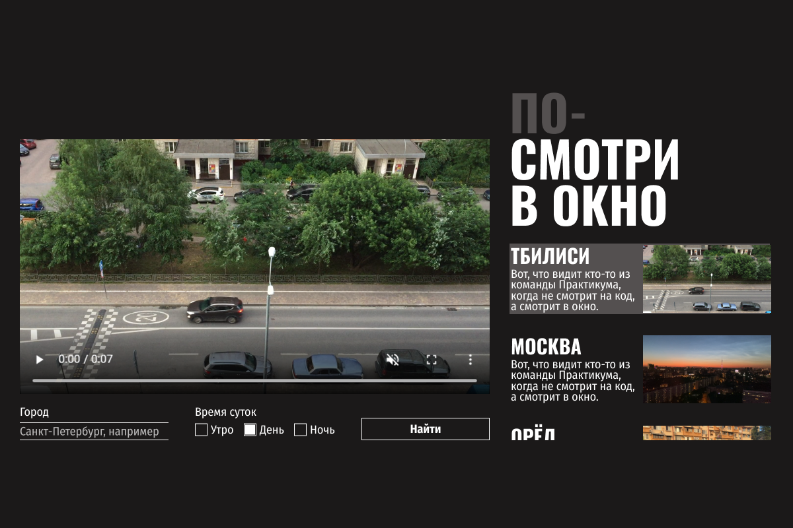

# Яндекс Практикум, 2 спринт, проект "Посмотри в окно"

## Оглавление

- [Скриншот](#скриншот)
- [Макет](#макет)
- [Автор](#автор)

### Скриншот

### Макет

- Макет задания: [Figma](https://www.figma.com/design/QHcvX1RsUI89CulRB7HLk6/%234-%D0%9F%D0%BE%D1%81%D0%BC%D0%BE%D1%82%D1%80%D0%B8-%D0%B2-%D0%BE%D0%BA%D0%BD%D0%BE?node-id=0-1&t=SctmF8B7C5rSp3GK-1)

### Автор 

- Github - [Nikolay Vashentsev](https://github.com/DonutsHunter)
